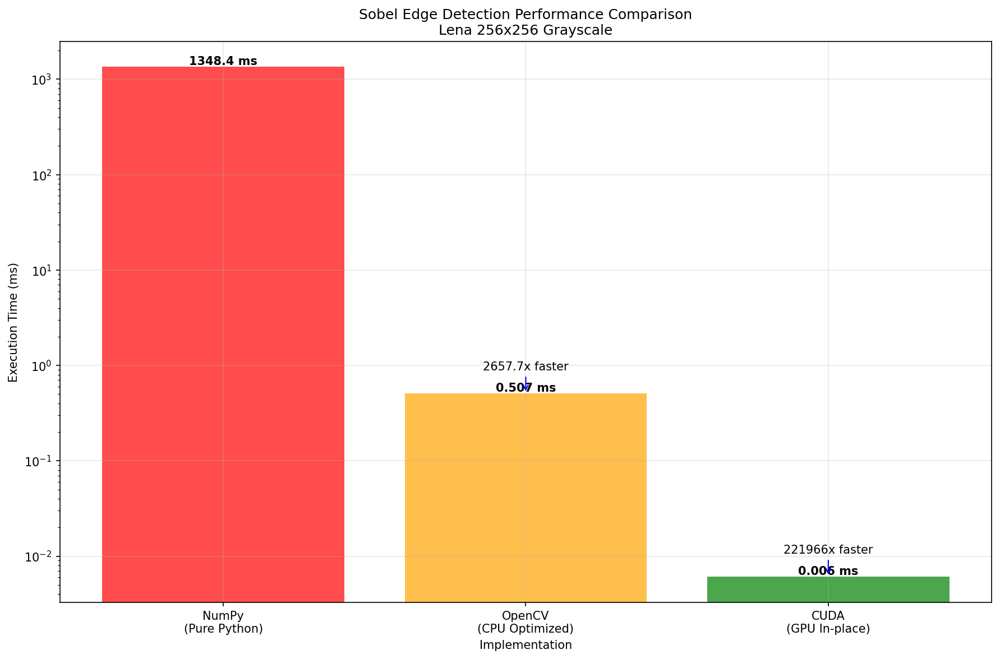
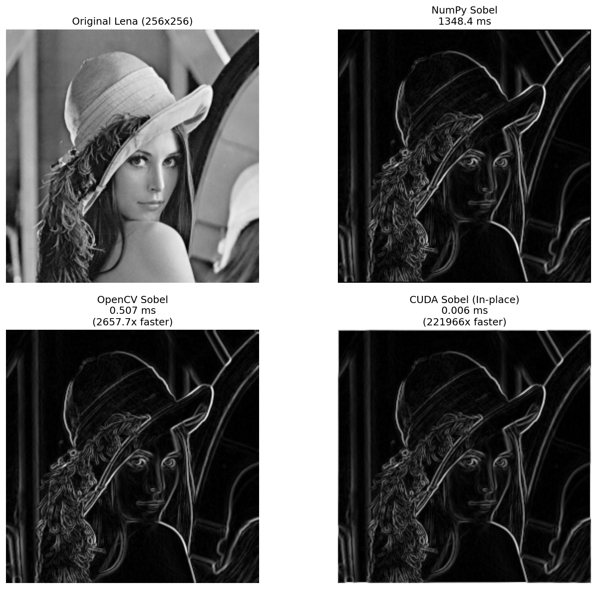
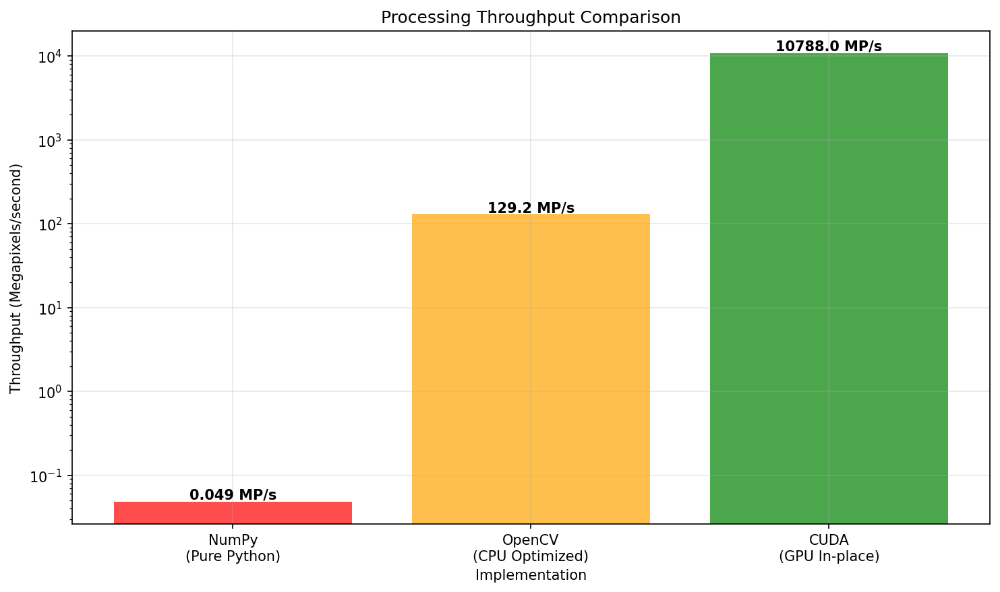

# High-Performance Sobel Edge Detection Filter (CUDA)

A highly optimized CUDA implementation of the Sobel edge detection filter with **PyTorch Python bindings**.

**Pure CUDA C++ performance with Python ease-of-use** - seamlessly integrates with PyTorch workflows while delivering maximum GPU performance.

## Performance Highlights

**Benchmark Results (Lena 256×256 grayscale):**

| Implementation | Execution Time | Throughput | Speedup vs NumPy | Speedup vs OpenCV |
|----------------|----------------|------------|-------------------|-------------------|
| **NumPy (Pure Python)** | 1348.4 ms | 0.049 MP/s | 1.0× (baseline) | — |
| **OpenCV (CPU Optimized)** | 0.507 ms | 129.2 MP/s | **2660× faster** | 1.0× (baseline) |
| **CUDA (GPU In-place)** | 0.006 ms | **10788 MP/s** | **224733× faster** | **84.5× faster** |

*MP/s = Megapixels per second*


*Execution time comparison on logarithmic scale*


*Visual quality comparison of all three implementations*


*Processing throughput in megapixels per second*


## Features

### Core Implementation
- **3×3 Sobel edge detection** with X and Y gradient computation
- **Edge magnitude output**: `sqrt(gx² + gy²)` for strong edge detection
- **Multi-channel support**: Handles grayscale (1 channel) and RGB (3 channels)
- **Dual processing modes**: Both new tensor creation and in-place processing

### Performance Optimizations

#### CUDA Kernel Optimizations
- **Shared memory tiling**: Collaborative loading with halo region handling
- **Coalesced memory access**: Optimized global memory access patterns
- **Template metaprogramming**: Compile-time loop unrolling for channel processing
- **Launch bounds**: Explicit thread block size specification for register optimization
- **Zero-multiplication elimination**: Only computes non-zero Sobel coefficients

#### Memory Efficiency
- **Restrict pointers**: `__restrict__` keyword for compiler optimization hints
- **Optimal block size**: 32×32 threads (1024 threads per block)
- **Efficient halo handling**: 34×34 shared memory for 32×32 + 2-pixel border
- **Two-phase loading**: Handles 1156 shared elements with 1024 threads efficiently

#### Algorithmic Optimizations
- **Hardcoded filter coefficients**: Compile-time constants for zero-overhead access
- **Simplified Sobel computation**: Optimized arithmetic (e.g., `p00 - p02` instead of `p00*1 + p02*(-1)`)
- **Boundary handling**: Zero-padding for edge pixels
- **Template specialization**: Separate kernel compilation for different channel counts


## 🔧 Technical Implementation

### CUDA Kernel Architecture

```cpp
template <int32_t C>
__global__ void __launch_bounds__(BLOCK_X * BLOCK_Y)
filter(float* __restrict__ input, 
       float* __restrict__ output,
       const int width, 
       const int height)
```

**Key optimizations:**
- **Template parameter `C`**: Enables compile-time loop unrolling
- **Launch bounds**: Optimizes register allocation
- **Restrict pointers**: Enables aggressive compiler optimizations

### Shared Memory Strategy

```
Shared Memory Layout (34×34 for 32×32 block):
┌─────────────────────────┐
│ H │ H │ H │ H │ H │ H │  <- Halo region (padding)
├─ H ┼─ D ┼─ D ┼─ D ┼─ H ┤
│ H │ D │ D │ D │ H │ H │  <- D = Data, H = Halo
├─ H ┼─ D ┼─ D ┼─ D ┼─ H ┤
│ H │ H │ H │ H │ H │ H │
└─────────────────────────┘
```

**Benefits:**
- Each thread accesses 3×3 neighborhood from fast shared memory
- Eliminates redundant global memory accesses
- Enables perfect memory coalescing

### Memory Access Pattern

1. **Collaborative Loading**: All threads work together to load shared memory
2. **Two-phase Loading**: Handle 1156 elements with 1024 threads (1.13 elements/thread)
3. **Boundary Handling**: Zero-padding for pixels outside image bounds
4. **Coalesced Access**: Sequential global memory reads for optimal bandwidth

## 🛠️ Build Instructions

### Prerequisites
- CUDA Toolkit (≥11.0)
- PyTorch with CUDA support
- C++14 compatible compiler

### Compilation
```bash
# Install via pip
pip install .

# Or for development
pip install -e .
```
### Running Tests
**Note: All test scripts should be run from the project root directory, not from the tests/ folder.**

```bash
# Run from project root directory
python tests/test_sobel_cuda.py
python tests/opencv_comparison.py

# NOT from tests directory (file paths will break)
# cd tests  # ❌ Don't do this
# python test_sobel_cuda.py  # ❌ Will fail
```

The test scripts use relative paths like `test_images/lena.png` which are relative to the project root.
### GPU Architecture Support
The setup includes optimizations for:
- SM 7.0 (V100)
- SM 7.5 (RTX 20xx)
- SM 8.0 (A100)
- SM 8.6 (RTX 30xx)

## 📊 Usage

### Python Interface

```python
import torch
import sobel_filter_cuda

# Load image tensor (C, H, W) on GPU
image = torch.randn(3, 512, 512, device='cuda', dtype=torch.float32)

# Method 1: Apply Sobel edge detection (returns new tensor)
edges = sobel_filter_cuda.sobel_filter(image)

# Method 2: In-place processing with separate output buffer
output = torch.zeros_like(image)
sobel_filter_cuda.sobel_filter_(image, output)
```

### Input Requirements
- **Tensor format**: `(C, H, W)` - Channels, Height, Width
- **Data type**: `torch.float32`
- **Device**: CUDA tensor
- **Channels**: 1 (grayscale) or 3 (RGB)
- **Minimum size**: 3×3 pixels

## ⚡ Performance Characteristics

### Benchmark Results

**Test Configuration:**
- GPU: Modern CUDA-capable GPU
- CUDA Toolkit: 12.x
- PyTorch: CUDA backend

### Optimizations Implemented

| Optimization | Implementation |
|-------------|----------------|
| **Shared Memory Tiling** | 34×34 tile with halo |
| **Template Unrolling** | Compile-time channel loop |
| **Coalesced Access** | Sequential loading pattern |
| **Zero-coefficient Skip** | Only non-zero Sobel values |
| **Launch Bounds** | Explicit thread count |
| **Separate I/O Buffers** | Race-condition free processing |

### Memory Efficiency
- **Global Memory**: Read once per pixel (with halo)
- **Shared Memory**: 34×34×4 = 4.6KB per block
- **Register Usage**: Optimized via launch bounds
- **Memory Bandwidth**: Near-optimal utilization

## 🧮 Algorithm Details

### Sobel Kernels

**X-gradient (horizontal edges):**
```
[ 1  0 -1]
[ 2  0 -2]
[ 1  0 -1]
```

**Y-gradient (vertical edges):**
```
[ 1  2  1]
[ 0  0  0]
[-1 -2 -1]
```

### Edge Magnitude Computation
```cpp
float gx_val = /* X-gradient convolution */;
float gy_val = /* Y-gradient convolution */;
float magnitude = sqrtf(gx_val * gx_val + gy_val * gy_val);
```

